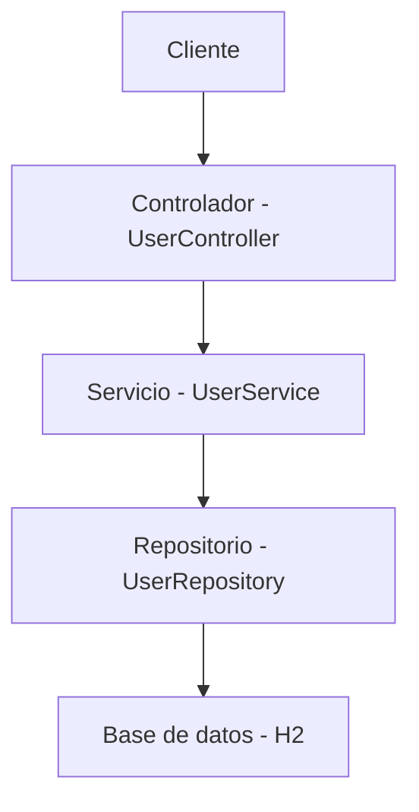

# API RESTful de Registro de Usuarios

Este proyecto es una API RESTful desarrollada con Spring Boot que permite registrar usuarios en una base de datos en memoria (H2). La API valida los datos de entrada, persiste la información del usuario y genera un token único para cada registro.

## **Requisitos**

- **Java**: JDK 17 o superior.
- **Maven**: 3.6 o superior (opcional si usas el wrapper `mvnw` incluido).
- **Herramienta para probar APIs REST**: Postman, cURL, o similar.

## **Tecnologías utilizadas**

- **Spring Boot**: Framework principal.
- **Spring Data JPA**: Para la persistencia de datos.
- **H2 Database**: Base de datos en memoria.
- **Lombok**: Para reducir el código boilerplate.
- **Spring Security Crypto**: Para codificar contraseñas.
- **JUnit**: Para pruebas unitarias e integración.

## API Documentation
### Swagger UI
Una vez que la aplicación esté ejecutándose, puedes acceder a la documentación interactiva de la API en:

**🔗 [Swagger UI - Local](http://localhost:8080/swagger-ui.html)**

Alternativamente, también puedes usar:
- http://localhost:8080/swagger-ui/index.html

### OpenAPI Specification
Para obtener la especificación OpenAPI en formato JSON:

**🔗 [API Docs JSON](http://localhost:8080/v3/api-docs)**

### Endpoints Principales

| Método | Endpoint | Descripción |
|--------|----------|-------------|
| POST | `/api/users/register` | Registrar nuevo usuario |

### Cómo usar Swagger UI

1. Inicia la aplicación (ver sección [Instalación](#instalación))
2. Abre tu navegador y ve a http://localhost:8080/swagger-ui.html
3. Explora los endpoints disponibles
4. Prueba las APIs directamente desde la interfaz
5. Revisa los modelos de datos y códigos de respuesta

### Configuración personalizada
- **Puerto por defecto:** 8080
- **Context path:** `/api`
- **Base URL:** http://localhost:8080

## **Ejecución del proyecto**

### **1. Clonar el repositorio**

Clona este repositorio en tu máquina local:

- git clone <URL_DEL_REPOSITORIO>
- cd apiuser

### **2. Ejecutar la aplicación**
Desde un IDE:
- Abre el proyecto en tu IDE favorito (IntelliJ IDEA, VS Code, Eclipse, etc.).
- Ejecuta la clase principal: ApiuserApplication.
- La aplicación estará disponible en http://localhost:8080

## **Endpoints de la API**

### **1. Registro de usuario**
- URL: /api/users/register
- Método: POST
- Encabezados:
    - Content-Type: application/json

- Cuerpo de la solicitud (JSON):
{
  "nombre": "Sancho Panza",
  "email": "sapa@testsermaluc.cl",
  "password": "Sermaluc1!",
  "telefonos": [
    {
      "numeroFono": "123789345",
      "codCiudad": "1",
      "codPais": "56"
    }
  ]
}

### **Respuestas**

- 201 Created (Registro exitoso):
{
    "id": "3ddcd3aa-d2f3-41b7-9f1c-d6c4f18100ee",
    "nombre": "Sancho Panza",
    "email": "sapa@testsermaluc.cl",
    "password": "$2a$10$FYPmOlmByDoVijJyUGan/uyzx/nGvnEFLHwV1eJ0GpsECMZYwoycW",
    "creado": "2025-04-22T23:06:39.1736299",
    "modificado": "2025-04-22T23:06:39.1736299",
    "ultimoLogin": "2025-04-22T23:06:39.1736299",
    "token": "c2f5c947-2b31-41e7-884f-23219a08bf9e",
    "estaActivo": true,
    "telefonos": [
        {
            "id": 1,
            "numeroFono": "123789345",
            "codCiudad": "1",
            "codPais": "56"
        }
    ]
}

- 400 Bad Request (Errores de validación):
{
  "mensaje": "El correo ya registrado"
}

{
  "mensaje": "La contraseña no cumple con el formato requerido"
}

## **Base de datos**
La aplicación utiliza una base de datos en memoria H2. Puedes acceder a la consola de H2 para verificar los datos almacenados:

- Abre un navegador y accede a http://localhost:8080/h2-console.
- Configura los siguientes valores:
    - JDBC URL: jdbc:h2:mem:testdb
    - User Name: sa
    - Password: (dejar vacío)
    - Ejecuta consultas SQL, por ejemplo:
        SELECT * FROM USUARIOS;
        SELECT * FROM TELEFONO;

### **Diagrama de la solución**

- Cliente: Envía solicitudes HTTP a la API.
- Controlador: Maneja las solicitudes y delega la lógica al servicio.
- Servicio: Contiene la lógica de negocio, como validaciones y generación de tokens.
- Repositorio: Interactúa con la base de datos para persistir y recuperar datos.
- Base de datos: Almacena los datos de los usuarios y teléfonos.
